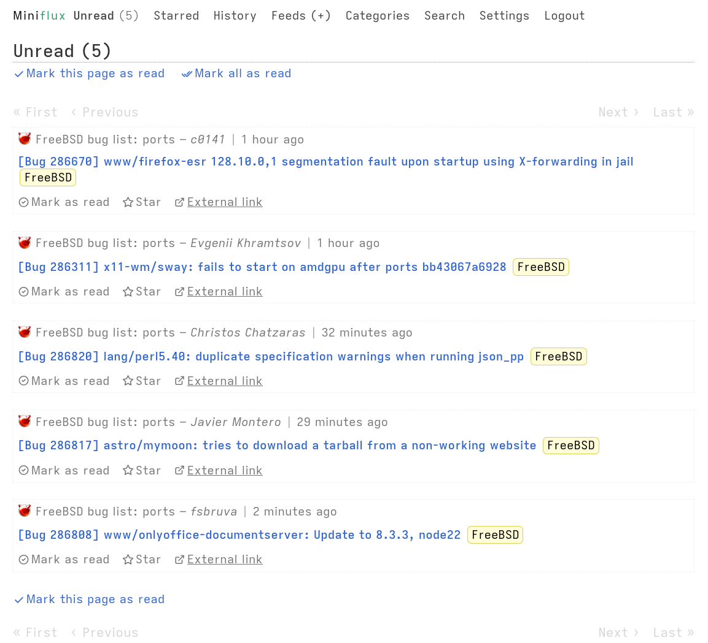

Miniflux 2
==========

Miniflux is a minimalist and opinionated feed reader.
It's simple, fast, lightweight and super easy to install.

Official website: <https://miniflux.app>

This project is an opinionated fork of Miniflux.

## Changes from [upstream](https://github.com/miniflux/v2):

* Google Reader API applies user's `Entry sorting` as default sort direction.

  The upstream uses hardcoded `desc`, if a reader didn't request specific sort
  direction, like [Read You] does at this moment. And entries always returned
  ordered newest first.

  [Read You]: https://github.com/Ashinch/ReadYou

* Refactor and simplify config parser.

  Use [env](https://github.com/caarlos0/env) and
  [godotenv](https://github.com/joho/godotenv) for parsing config and env
  variables. Validate it using
  [validator](https//github.com/go-playground/validator).

* Add `LOG_FORMAT=human`.

  It logs something like:
  ```
  2025/04/20 16:02:00 INFO Starting HTTP server listen_address=127.0.0.1:8080
  ```
  instead of
  ```
  time=2025-04-20T16:02:00.561+02:00 level=INFO msg="Starting HTTP server" listen_address=127.0.0.1:8080
  ```

* Automatically reopen log file(s) on rotation.

* Multiple log files.

  With configuration like this

  ```
  LOG_0_FILE=stderr
  LOG_0_FORMAT=human
  LOG_0_LEVEL=warning

  LOG_1_FILE=/var/log/miniflux/miniflux.log
  LOG_1_FORMAT=human
  LOG_1_DATE_TIME=true
  LOG_1_LEVEL=info
  ```

  all errors and warnings will be logged to both stderr and
  `/var/log/miniflux/miniflux.log`. Info messages will be logged to
  `miniflux.log` only.

  Any error from second logger will be logged by first logger. Errors from first
  logger are ignored.

* Refactor CLI.

  Use [cobra](https://github.com/spf13/cobra) for parsing flags and args:

  ```
  $ miniflux -h
  Miniflux is a minimalist and opinionated feed reader.

  Usage:
    miniflux [flags]
    miniflux [command]

  Available Commands:
    completion               Generate the autocompletion script for the specified shell
    config-dump              Print parsed configuration values
    create-admin             Create an admin user from an interactive terminal
    export-user-feeds        Export user feeds
    flush-sessions           Flush all sessions (disconnect users)
    healthcheck              Perform a health check on the given endpoint
    help                     Help about any command
    info                     Show build information
    migrate                  Run SQL migrations
    refresh-feeds            Refresh a batch of feeds and exit
    reset-feed-errors        Clear all feed errors for all users
    reset-feed-next-check-at Reset the next check time for all feeds
    reset-password           Reset user password
    run-cleanup-tasks        Run cleanup tasks (delete old sessions and archives old entries)

  Flags:
    -c, --config-file string   Path to configuration file
    -d, --debug                Show debug logs
    -h, --help                 help for miniflux
    -v, --version              version for miniflux

  Use "miniflux [command] --help" for more information about a command.
  ```

* Refactor storage and switch to [pgx](https://github.com/jackc/pgx)

  `DATABASE_URL` have additional variables for pool configuration:

  ```
  pool_max_conn_idle_time: duration string (default 30 minutes)
  pool_health_check_period: duration string (default 1 minute)
  pool_max_conn_lifetime_jitter: duration string (default 0)
  ```

  See [ParseConfig] for details.

  Don't specify `pool_max_conns`, `pool_min_conns` and `pool_max_conn_lifetime`,
  because config variables `DATABASE_MAX_CONNS`, `DATABASE_MIN_CONNS` and
  `DATABASE_CONNECTION_LIFETIME` overwrite it.

  `DATABASE_MAX_CONNS` changed its default from 20 to the greater of 4 or
  `runtime.NumCPU()`.

  [ParseConfig]: https://pkg.go.dev/github.com/jackc/pgx/v5@v5.7.4/pgxpool#ParseConfig

* Optionally prefer site icon, instead of feed icon.

  New option `PREFER_SITE_ICON=true` configures `miniflux` always use
  auto-detected site icon, instead of icon found in feed description.

* Limit max number of connections per server.

  By default the maximum is 8 connections per server. This limit can be changed
  by adding `CONNECTIONS_PER_SERVER` to the config, like

  ```
  CONNECTIONS_PER_SERVER=10
  ```

  which increases the limit to 10 connections per server.

* Changed a little how article items looks like.

  Light theme:
  

  Dark theme:
  

* Republished entries marked as unread.

* Custom comments URL per feed.

  Any feed can be configured with custom comments URL instead of feed's comment
  URL via edit feed UI. The new setting expected to be a templated string like:
  `{{ .URL }}/comments/`. This example appends `/comments/` to entry URL and use
  it as comments URL of this entry. As a shortcut, if the template begins with
  `/` it directly appends to entry URL, like in previous example.

* Click on comments URL mark this entry as read.

  If mark entries as read when viewed enabled in user settings.

Features
--------

### Feed Reader

- Supported feed formats: Atom 0.3/1.0, RSS 1.0/2.0, and JSON Feed 1.0/1.1.
- [OPML](https://en.wikipedia.org/wiki/OPML) file import/export and URL import.
- Supports multiple attachments (podcasts, videos, music, and images enclosures).
- Plays videos from YouTube directly inside Miniflux.
- Organizes articles using categories and bookmarks.
- Share individual articles publicly.
- Fetches website icons (favicons).
- Saves articles to third-party services.
- Provides full-text search (powered by Postgres).
- Available in 20 languages: Portuguese (Brazilian), Chinese (Simplified and Traditional), Dutch, English (US), Finnish, French, German, Greek, Hindi, Indonesian, Italian, Japanese, Polish, Romanian, Russian, Taiwanese POJ, Ukrainian, Spanish, and Turkish.

### Privacy

- Removes pixel trackers.
- Strips tracking parameters from URLs (e.g., `utm_source`, `utm_medium`, `utm_campaign`, `fbclid`, etc.).
- Retrieves original links when feeds are sourced from FeedBurner.
- Opens external links with attributes `rel="noopener noreferrer" referrerpolicy="no-referrer"` for improved security.
- Implements the HTTP header `Referrer-Policy: no-referrer` to prevent referrer leakage.
- Provides a media proxy to avoid tracking and resolve mixed content warnings when using HTTPS.
- Plays YouTube videos via the privacy-focused domain `youtube-nocookie.com`.
- Supports alternative YouTube video players such as [Invidious](https://invidio.us).
- Blocks external JavaScript to prevent tracking and enhance security.

### Bot Protection Bypass Mechanisms

- Optionally disable HTTP/2 to mitigate fingerprinting.
- Allows configuration of a custom user agent.
- Supports adding custom cookies for specific use cases.
- Enables the use of proxies for enhanced privacy or bypassing restrictions.

### Content Manipulation

- Fetches the original article and extracts only the relevant content using a local Readability parser.
- Allows custom scraper rules based on <abbr title="Cascading Style Sheets">CSS</abbr> selectors.
- Supports custom rewriting rules for content manipulation.
- Provides a regex filter to include or exclude articles based on specific patterns.
- Optionally permits self-signed or invalid certificates (disabled by default).
- Scrapes YouTube's website to retrieve video duration as read time or uses the YouTube API (disabled by default).

### User Interface

- Optimized stylesheet for readability.
- Responsive design that adapts seamlessly to desktop, tablet, and mobile devices.
- Minimalistic and distraction-free user interface.
- No requirement to download an app from Apple App Store or Google Play Store.
- Can be added directly to the home screen for quick access.
- Supports a wide range of keyboard shortcuts for efficient navigation.
- Optional touch gesture support for navigation on mobile devices.
- Custom stylesheets and JavaScript to personalize the user interface to your preferences.
- Themes:
    - Light (Sans-Serif)
    - Light (Serif)
    - Dark (Sans-Serif)
    - Dark (Serif)
    - System (Sans-Serif) – Automatically switches between Dark and Light themes based on system preferences.
    - System (Serif)

### Integrations

- 25+ integrations with third-party services: [Apprise](https://github.com/caronc/apprise), [Betula](https://sr.ht/~bouncepaw/betula/), [Cubox](https://cubox.cc/), [Discord](https://discord.com/), [Espial](https://github.com/jonschoning/espial), [Instapaper](https://www.instapaper.com/), [LinkAce](https://www.linkace.org/), [Linkding](https://github.com/sissbruecker/linkding), [LinkWarden](https://linkwarden.app/), [Matrix](https://matrix.org), [Notion](https://www.notion.com/), [Ntfy](https://ntfy.sh/), [Nunux Keeper](https://keeper.nunux.org/), [Pinboard](https://pinboard.in/), [Pocket](https://getpocket.com/), [Pushover](https://pushover.net), [RainDrop](https://raindrop.io/), [Readeck](https://readeck.org/en/), [Readwise Reader](https://readwise.io/read), [RssBridge](https://rss-bridge.org/), [Shaarli](https://github.com/shaarli/Shaarli), [Shiori](https://github.com/go-shiori/shiori), [Slack](https://slack.com/), [Telegram](https://telegram.org), [Wallabag](https://www.wallabag.org/), etc.
- Bookmarklet for subscribing to websites directly from any web browser.
- Webhooks for real-time notifications or custom integrations.
- Compatibility with existing mobile applications using the Fever or Google Reader API.
- REST API with client libraries available in [Go](https://github.com/miniflux/v2/tree/main/client) and [Python](https://github.com/miniflux/python-client).

### Authentication

- Local username and password.
- Passkeys ([WebAuthn](https://en.wikipedia.org/wiki/WebAuthn)).
- Google (OAuth2).
- Generic OpenID Connect.
- Reverse-Proxy authentication.

### Technical Stuff

- Written in [Go (Golang)](https://golang.org/).
- Single binary compiled statically without dependency.
- Works only with [PostgreSQL](https://www.postgresql.org/).
- Does not use any ORM or any complicated frameworks.
- Uses modern vanilla JavaScript only when necessary.
- All static files are bundled into the application binary using the Go `embed` package.
- Supports the Systemd `sd_notify` protocol for process monitoring.
- Configures HTTPS automatically with Let's Encrypt.
- Allows the use of custom <abbr title="Secure Sockets Layer">SSL</abbr> certificates.
- Supports [HTTP/2](https://en.wikipedia.org/wiki/HTTP/2) when TLS is enabled.
- Updates feeds in the background using an internal scheduler or a traditional cron job.
- Sanitizes external content before rendering it.
- Enforces a [Content Security Policy](https://developer.mozilla.org/en-US/docs/Web/HTTP/CSP) that permits only application JavaScript and blocks inline scripts and styles.
- Uses native lazy loading for images and iframes.
- Compatible only with modern browsers.
- Adheres to the [Twelve-Factor App](https://12factor.net/) methodology.
- Provides official Debian/RPM packages and pre-built binaries.
- Publishes a Docker image to Docker Hub, GitHub Registry, and Quay.io Registry, with ARM architecture support.

Documentation
-------------

The Miniflux documentation is available here: <https://miniflux.app/docs/> ([Man page](https://miniflux.app/miniflux.1.html))

- [Opinionated?](https://miniflux.app/opinionated.html)
- [Features](https://miniflux.app/features.html)
- [Requirements](https://miniflux.app/docs/requirements.html)
- [Installation Instructions](https://miniflux.app/docs/installation.html)
- [Upgrading to a New Version](https://miniflux.app/docs/upgrade.html)
- [Configuration](https://miniflux.app/docs/configuration.html)
- [Command Line Usage](https://miniflux.app/docs/cli.html)
- [User Interface Usage](https://miniflux.app/docs/ui.html)
- [Keyboard Shortcuts](https://miniflux.app/docs/keyboard_shortcuts.html)
- [Integration with External Services](https://miniflux.app/docs/#integrations)
- [Rewrite and Scraper Rules](https://miniflux.app/docs/rules.html)
- [API Reference](https://miniflux.app/docs/api.html)
- [Development](https://miniflux.app/docs/development.html)
- [Internationalization](https://miniflux.app/docs/i18n.html)
- [Frequently Asked Questions](https://miniflux.app/faq.html)

Screenshots
-----------

Default theme:


Dark theme when using keyboard navigation:


Credits
-------

- Authors: Frédéric Guillot - [List of contributors](https://github.com/miniflux/v2/graphs/contributors)
- Distributed under Apache 2.0 License
